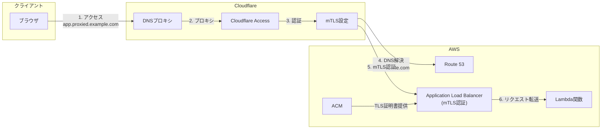

# はじめに

この記事では、AWS Application Load Balancer (ALB)でmTLS認証を実装し、さらにCloudflare Accessと組み合わせて二重の認証を実現する方法について解説します。

## 背景と課題

社内システムのセキュリティ対策として、従来はIP制限による保護が一般的でした。しかし、以下のような課題が発生しています:

- リモートワークの普及により、固定IPからのアクセスに限定できない
- モバイルワークやクラウドサービスからのアクセスなど、動的IPへの対応が必要
- VPNを導入せずにセキュアなアクセスを実現したい

これらの課題に対して、IPベースではない新しいアクセス制御の仕組みが必要となっています。

本記事では、以下の2つの認証方式を組み合わせることで、IPに依存しない強固なアクセス制御を実現します:

1. **Cloudflare Access**による認証
   - メールドメインベースでのアクセス制御
   - 社内システムへのアクセスを特定のドメインのメールアドレスを持つユーザーのみに制限
   - ブラウザベースでの認証が可能

2. **mTLS認証**によるクライアント認証
   - クライアント証明書を使用した相互認証
   - 不正なクライアントからのアクセスを防止
   - 今回はCloudflareからのアクセスに限定するために使用

## この記事の目的

このアーキテクチャを実装することで、以下のようなメリットが得られます:

- IPアドレスに依存しない、柔軟なアクセス制御
- システムへのアクセスを特定のドメインのユーザーに制限
- クライアント証明書による追加のセキュリティレイヤー
- CloudflareのDNSプロキシによるオリジンサーバー(ALB)の保護

## システム構成の概要

本記事では、以下の要素を組み合わせて実装します:

- AWS ALBのmTLS認証機能
- Cloudflare Accessによるアクセス制御
- Lambda関数によるバックエンド処理

なお、実装にはTerraformを使用してインフラのコード化を行います。

# アーキテクチャの詳細

このプロジェクトでは以下のようなアーキテクチャを実装します:

1. クライアント認証(mTLS)を有効化したALB
2. バックエンドとしてLambda関数
3. Cloudflare Accessによる認証
4. クライアント証明書の管理

## ドメイン構成

このアーキテクチャでは、2つの異なるドメインを使用します:

1. **ALBのオリジンドメイン** (例: `alb.example.com`)
   - Route53で管理
   - ALBのエンドポイント
   - アクセスはmTLS認証により制限される
     - 適切なクライアント証明書なしではアクセスが拒否される
     - 今回はCloudflare側に証明書を設定し、ALBへのアクセスを許可している

2. **アプリケーションドメイン** (例: `app.proxied.example.com`)
   - Cloudflareで管理
   - エンドユーザーが実際にアクセスするドメイン
   - Cloudflare AccessとDNSプロキシを有効化

エンドユーザーは常にCloudflareで管理されているアプリケーションドメインにアクセスし、Cloudflareが認証を行った後、クライアント証明書を使用してALBのオリジンドメインにアクセスします。



## 認証フロー

1. ブラウザからアプリケーションにアクセス(CloudflareのDNSプロキシによりALBは隠蔽)
2. Cloudflare Accessによる認証(メールドメインベース)
3. Cloudflareによるクライアント証明書を使用したmTLS認証でALBに接続
   - Route53によるALBドメインの名前解決
   - ACMによるTLS証明書を使用した通信
4. 認証成功後、リクエストをLambda関数に転送

# 実装手順

## 1. Terraformの基本設定

Terraformを使用してインフラストラクチャをコード化します。まず、必要なプロバイダーと基本設定を行います。

### プロバイダー構成

```hcl
terraform {
  required_providers {
    aws = {
      source  = "hashicorp/aws"
      version = "~> 5.0"
    }
    cloudflare = {
      source  = "cloudflare/cloudflare"
      version = "4.52.0"  # v4の最新バージョンを使用
    }
    # その他のプロバイダー設定は省略
  }
}
```

このプロジェクトでは主にAWSとCloudflareのリソースを管理します。その他、Lambda関数のパッケージング用の`archive`、クライアント証明書生成用の`tls`、ローカルファイル操作用の`local`プロバイダーも使用します。
最新のCloudflare Providerのバージョンはv5ですが、安定性が低く実際に動作しないことも考えられるため、v4を使用します。
AWS Providerの方はv6が最新ですが、動作確認はしていません。

### モジュール構成

コードの再利用性と保守性を高めるため、以下のモジュールに分割して実装します:

- `lambda`: バックエンド関数の定義
  - Lambda関数本体とIAMロールの設定
- `cloudflare_zone`: CloudflareゾーンとmTLS設定
  - ゾーン設定とクライアント証明書の管理
  - Route53に登録したドメインをプロキシするためのドメインの設定
- `cloudflare_access`: Cloudflare Accessの設定
  - アクセスポリシーとアプリケーション設定
- `cert`: ACM証明書の管理
  - ALB用のサーバー証明書の発行と検証
- `client_cert`: クライアント証明書とトラストストアの管理
  - ALBで使用するクライアント証明書の生成と管理
- `alb`: Application Load Balancerの設定
  - mTLS認証の設定とリスナールールの定義
  - Route53への登録
- `alb_target`: ALBターゲットグループの設定
  - Lambda関数とALBの統合
  - 今回はBackendとしてLambdaを使用していますが、ECSなど別のBackendを使用する際には適宜変更できます

各モジュールの詳細な実装については、[GitHubリポジトリ](https://github.com/k-kojima-yumemi/alb-mtls-test)を参照してください。

## 2. ALBの設定

ALBの設定では、主にmTLS認証の有効化と、Lambda関数をターゲットとするリスナールールの設定を行います。

### mTLS認証の設定

ALBでmTLS認証を有効にするには、以下の2つの要素が必要です:

1. ALB自身のサーバー証明書（ACMで管理）
2. クライアント証明書を検証するためのトラストストア

```hcl
# ALBのリスナー設定
resource "aws_lb_listener" "https" {
  load_balancer_arn = aws_lb.this.arn
  port              = "443"
  protocol          = "HTTPS"
  ssl_policy        = "ELBSecurityPolicy-TLS13-1-2-2021-06"
  certificate_arn   = var.certificate_arn

  # mTLS認証の有効化
  mutual_authentication {
    mode            = "verify"
    trust_store_arn = var.trust_store_arn
  }

  # デフォルトアクション
  default_action {
    type = "fixed-response"
    fixed_response {
      content_type = "text/plain"
      message_body = "Not Found"
      status_code  = "404"
    }
  }
}
```

ポイントとなる設定:
- `mutual_authentication`: mTLS認証を有効化し、クライアント証明書の検証を実施

### セキュリティグループの設定

ALBのセキュリティグループでは、HTTPSのポート443へのアクセスを許可します:

```hcl
resource "aws_security_group" "alb" {
  name        = "${var.name}-sg"
  vpc_id      = data.aws_vpc.main.id
  description = "SG for ${var.name}"
  ingress {
    from_port   = 443
    to_port     = 443
    protocol    = "TCP"
    cidr_blocks = ["0.0.0.0/0"]  # 全てのIPからのアクセスを許可
  }
  egress {
    from_port        = 0
    to_port          = 0
    protocol         = "-1"
    cidr_blocks      = ["0.0.0.0/0"]
    ipv6_cidr_blocks = ["::/0"]
  }
}
```

この設定では全てのIPアドレスからのアクセスを許可していますが、本番環境ではセキュリティを強化するために、CloudflareのIPレンジのみに制限することを推奨します。CloudflareのIPレンジは以下のURLで公開されています:

- IPv4: https://www.cloudflare.com/ips-v4
- IPv6: https://www.cloudflare.com/ips-v6

これらのIPレンジを動的に取得して設定する方法もありますが、今回のデモ実装では簡略化のため全てのIPを許可しています。実際の本番環境での実装時には、要件に応じて適切なIPレンジの制限を検討してください。

### Route53の設定

ALBのドメインをRoute53に登録します。このドメインはCloudflareでプロキシされます:

```hcl
resource "aws_route53_record" "alb" {
  zone_id = data.aws_route53_zone.this.zone_id
  name    = var.domain
  type    = "A"

  alias {
    name                   = aws_lb.this.dns_name
    zone_id                = aws_lb.this.zone_id
    evaluate_target_health = true
  }
}
```

### Lambda関数との統合

ALBからLambda関数へのルーティングを設定します:

```hcl
resource "aws_lb_listener_rule" "lambda" {
  listener_arn = aws_lb_listener.https.arn
  priority     = var.priority

  action {
    type             = "forward"
    target_group_arn = aws_lb_target_group.lambda.arn
  }

  condition {
    path_pattern {
      values = [var.path_pattern]
    }
  }
}
```

これらのALB設定により、以下が実現されます:

1. CloudflareからのmTLS認証付きリクエストのみを受け付け
2. クライアント証明書の検証を実施
3. 認証成功時のみLambda関数にリクエストを転送

## 3. Lambda関数の実装

バックエンドのLambda関数は、テスト用の簡単な実装として、リクエストヘッダーをそのまま返すエコーサーバーとして実装しています。Node.js 22.xのランタイムを使用し、基本的なCloudWatch Logsへの書き込み権限のみを付与しています。

実際のプロダクション環境では、このLambda関数を任意のバックエンド処理に置き換えることができます。

## 4. クライアント証明書の管理

mTLS認証を実現するために、以下の3つの要素を設定します:

1. ルートCA証明書の生成
2. クライアント証明書の生成
3. ALBのトラストストアの設定

### ルートCA証明書の生成

まず、クライアント証明書の署名に使用するルートCA証明書を生成します:

> **注意**: 本記事では説明のため、Terraformで秘密鍵を生成していますが、この方法は本番環境では推奨されません。Terraformのstateファイルに秘密鍵の情報が平文で保存されてしまうためです。本番環境では、以下のような代替手段を検討してください:
> 
> - AWS Certificate Manager Private Certificate Authority (ACM PCA)の使用
> - HashiCorp Vaultなどのシークレット管理サービスの利用
> - 手動での秘密鍵生成と、生成された公開鍵のみをTerraformで管理

```hcl
# ルートCAの秘密鍵
resource "tls_private_key" "root" {
  algorithm = "RSA"

  rsa_bits  = 4096
}

# ルートCA証明書
resource "tls_self_signed_cert" "root" {
  private_key_pem = tls_private_key.root.private_key_pem
  subject {
    common_name  = var.root_common_name
    organization = var.organization
    country      = "jp"
    locality     = "tokyo"
  }
  validity_period_hours = 43824  # 5年間
  is_ca_certificate     = true
  allowed_uses = [
    "digital_signature",
    "cert_signing",
    "crl_signing",
  ]
}
```

### クライアント証明書の生成

次に、CloudflareがALBに対して認証を行うためのクライアント証明書を生成します:

> **注意**: クライアント証明書の秘密鍵についても同様に、本番環境では適切なシークレット管理の仕組みを使用してください。

```hcl
# クライアント証明書の秘密鍵
resource "tls_private_key" "client" {
  algorithm = "RSA"
  rsa_bits  = 4096
}

# 証明書署名要求（CSR）
resource "tls_cert_request" "client" {
  private_key_pem = tls_private_key.client.private_key_pem
  subject {
    common_name  = var.client_common_name
    organization = var.organization
    country      = "jp"
    locality     = "tokyo"
  }
}

# クライアント証明書の生成
resource "tls_locally_signed_cert" "client" {
  cert_request_pem      = tls_cert_request.client.cert_request_pem
  ca_cert_pem           = tls_self_signed_cert.root.cert_pem
  ca_private_key_pem    = tls_self_signed_cert.root.private_key_pem
  validity_period_hours = 17520  # 2年間
  allowed_uses = [
    "digital_signature",
    "key_encipherment",
    "client_auth",
  ]
}
```

### トラストストアの設定

生成したルートCA証明書をALBのトラストストアに登録します:

```hcl
# S3バケットの作成
resource "aws_s3_bucket" "store" {
  bucket = var.trust_store_s3_name
}

# ルートCA証明書をS3にアップロード
resource "aws_s3_object" "root_ca_cert" {
  bucket       = aws_s3_bucket.store.bucket
  key          = "root_ca.crt"
  content      = tls_self_signed_cert.root.cert_pem
  content_type = "text/plain"
}

# ALBのトラストストアを作成
resource "aws_lb_trust_store" "store" {
  name = var.trust_store_name
  ca_certificates_bundle_s3_bucket = aws_s3_object.root_ca_cert.bucket
  ca_certificates_bundle_s3_key    = aws_s3_object.root_ca_cert.key
}
```

この設定により:

1. ルートCA証明書とクライアント証明書のペアを生成
2. ルートCA証明書をS3バケットに保存
3. S3のルートCA証明書をALBのトラストストアとして登録
4. 生成したクライアント証明書をCloudflareに登録（次のセクションで説明）

これにより、CloudflareからALBへのリクエスト時にmTLS認証が可能になります。


## 5. Cloudflare Accessの設定

Cloudflare Accessを使用して、特定のメールドメインを持つユーザーのみがアプリケーションにアクセスできるように設定します。

### アプリケーションの登録

まず、Cloudflare Accessで保護するアプリケーションを登録します:

```hcl
resource "cloudflare_zero_trust_access_application" "main" {
  zone_id          = data.cloudflare_zone.zone.zone_id
  name             = var.application_name
  domain           = var.cloudflare_domain
  type             = "self_hosted"
  session_duration = "72h"
  policies = [
    cloudflare_zero_trust_access_policy.allow.id,
  ]
}
```

主な設定項目:
- `type`: `self_hosted`を指定し、ALBをバックエンドとして使用
- `session_duration`: 認証セッションの有効期間（この例では72時間）
- `policies`: アクセスポリシーのリストを指定

### アクセスポリシーの設定

次に、アプリケーションへのアクセスを制御するポリシーを設定します:

```hcl
resource "cloudflare_zero_trust_access_policy" "allow" {
  account_id = data.cloudflare_zone.zone.account_id
  name       = "Allow Policy for ${var.application_name}"
  decision   = "allow"
  include {
    email        = var.email_list      # 特定のメールアドレス
    email_domain = var.email_domain_list  # 特定のドメイン
  }
  lifecycle { create_before_destroy = true }
}
```

このポリシーでは以下のような設定が可能です:

1. **特定のメールアドレス**による制限
   - 個別のメールアドレスを指定して、特定のユーザーのみにアクセスを許可
   - 例:`["user1@example.com", "user2@example.com"]`

2. **メールドメイン**による制限
   - 特定のドメインに属するすべてのメールアドレスにアクセスを許可
   - 例:`["example.com", "company.co.jp"]`

### オプション:IPアドレスによるバイパス設定

必要に応じて、特定のIPアドレスからのアクセスについては認証をバイパスすることも可能です:

```hcl
resource "cloudflare_zero_trust_access_policy" "bypass" {
  account_id = data.cloudflare_zone.zone.account_id
  name       = "Bypass Policy for ${var.application_name}"
  decision   = "bypass"
  include {
    ip = var.bypass_ip_list
  }
  lifecycle { create_before_destroy = true }
}
```

このポリシーを使用することで、以下のようなユースケースに対応できます:

- CI/CDパイプラインからのアクセス
- 監視システムからのヘルスチェック
- 社内ネットワークからの直接アクセス

> **注意**: バイパスポリシーを使用する場合は、セキュリティリスクを十分に考慮してください。特に、IPアドレスのスプーフィングなどの攻撃に対する対策が必要です。

### 認証フロー

Cloudflare Accessを設定すると、以下のような認証フローが実現されます:

1. ユーザーがアプリケーションにアクセス
2. Cloudflare Accessによる認証画面が表示
3. ユーザーが指定されたメールドメインでログイン
4. 認証成功後、Cloudflareがクライアント証明書を使用してALBに接続
5. ALBでmTLS認証を実施
6. すべての認証が成功した場合のみ、アプリケーションにアクセス可能

この二重の認証により、以下のようなセキュリティ強化が実現できます:

- メールドメインベースの認証による、組織メンバーのみのアクセス制御
- クライアント証明書による、Cloudflare経由のアクセスの保証
- セッション管理による、定期的な再認証の強制

# 動作確認

実装したシステムの動作確認として、以下のようなアクセスパターンをテストします。

## 1. ALBへの直接アクセス（失敗例）

ALBに直接アクセスした場合、mTLS認証エラーとなります:

```bash
$ curl -v https://alb.example.com
* Host alb.example.com:443 was resolved.
* IPv6: (none)
* IPv4: 52.197.193.151, 54.178.76.125, 54.178.125.93
*   Trying 52.197.193.151:443...
* Connected to alb.example.com (52.197.193.151) port 443
* ALPN: curl offers h2,http/1.1
* (304) (OUT), TLS handshake, Client hello (1):
*  CAfile: /etc/ssl/cert.pem
*  CApath: none
* (304) (IN), TLS handshake, Server hello (2):
* (304) (IN), TLS handshake, Unknown (8):
* (304) (IN), TLS handshake, Request CERT (13):
* (304) (IN), TLS handshake, Certificate (11):
* (304) (IN), TLS handshake, CERT verify (15):
* (304) (IN), TLS handshake, Finished (20):
* (304) (OUT), TLS handshake, Certificate (11):
* (304) (OUT), TLS handshake, Finished (20):
* SSL connection using TLSv1.3 / AEAD-AES128-GCM-SHA256 / [blank] / UNDEF
* ALPN: server accepted h2
* Server certificate:
*  subject: CN=alb.example.com
*  start date: Mar  2 00:00:00 2025 GMT
*  expire date: Apr  1 23:59:59 2026 GMT
*  subjectAltName: host "alb.example.com" matched cert's "alb.example.com"
*  issuer: C=US; O=Amazon; CN=Amazon RSA 2048 M02
*  SSL certificate verify ok.
* using HTTP/2
* [HTTP/2] [1] OPENED stream for https://alb.example.com/
* [HTTP/2] [1] [:method: GET]
* [HTTP/2] [1] [:scheme: https]
* [HTTP/2] [1] [:authority: alb.example.com]
* [HTTP/2] [1] [:path: /]
* [HTTP/2] [1] [user-agent: curl/8.7.1]
* [HTTP/2] [1] [accept: */*]
> GET / HTTP/2
> Host: alb.example.com
> User-Agent: curl/8.7.1
> Accept: */*
> 
* Request completely sent off
* Recv failure: Connection reset by peer
* LibreSSL SSL_read: LibreSSL/3.3.6: error:02FFF036:system library:func(4095):Connection reset by peer, errno 54
* Failed receiving HTTP2 data: 56(Failure when receiving data from the peer)
* Connection #0 to host alb.example.com left intact
curl: (56) Recv failure: Connection reset by peer
```

## 2. クライアント証明書を使用したALBへの直接アクセス

クライアント証明書を使用するとアクセス可能です

```bash
$ curl -vsS https://alb.example.com --key client_cert.key --cert client_cert.crt | jq
* Host alb.example.com:443 was resolved.
* IPv6: (none)
* IPv4: 52.197.193.151, 54.178.76.125, 54.178.125.93
*   Trying 52.197.193.151:443...
* Connected to alb.example.com (52.197.193.151) port 443
* ALPN: curl offers h2,http/1.1
* (304) (OUT), TLS handshake, Client hello (1):
} [344 bytes data]
*  CAfile: /etc/ssl/cert.pem
*  CApath: none
* (304) (IN), TLS handshake, Server hello (2):
{ [122 bytes data]
* (304) (IN), TLS handshake, Unknown (8):
{ [19 bytes data]
* (304) (IN), TLS handshake, Request CERT (13):
{ [45 bytes data]
* (304) (IN), TLS handshake, Certificate (11):
{ [3852 bytes data]
* (304) (IN), TLS handshake, CERT verify (15):
{ [264 bytes data]
* (304) (IN), TLS handshake, Finished (20):
{ [36 bytes data]
* (304) (OUT), TLS handshake, Certificate (11):
} [1422 bytes data]
* (304) (OUT), TLS handshake, CERT verify (15):
} [520 bytes data]
* (304) (OUT), TLS handshake, Finished (20):
} [36 bytes data]
* SSL connection using TLSv1.3 / AEAD-AES128-GCM-SHA256 / [blank] / UNDEF
* ALPN: server accepted h2
* Server certificate:
*  subject: CN=alb.example.com
*  start date: Mar  2 00:00:00 2025 GMT
*  expire date: Apr  1 23:59:59 2026 GMT
*  subjectAltName: host "alb.example.com" matched cert's "alb.example.com"
*  issuer: C=US; O=Amazon; CN=Amazon RSA 2048 M02
*  SSL certificate verify ok.
* using HTTP/2
* [HTTP/2] [1] OPENED stream for https://alb.example.com/
* [HTTP/2] [1] [:method: GET]
* [HTTP/2] [1] [:scheme: https]
* [HTTP/2] [1] [:authority: alb.example.com]
* [HTTP/2] [1] [:path: /]
* [HTTP/2] [1] [user-agent: curl/8.7.1]
* [HTTP/2] [1] [accept: */*]
> GET / HTTP/2
> Host: alb.example.com
> User-Agent: curl/8.7.1
> Accept: */*
> 
* Request completely sent off
< HTTP/2 200 
< date: Sun, 02 Mar 2025 12:29:13 GMT
< content-type: application/json
< content-length: 2838
< 
{ [2838 bytes data]
* Connection #0 to host alb.example.com left intact
{
  "message": "Hello from Lambda!",
  "event": {
    "requestContext": {
      "elb": {
        "targetGroupArn": "[HIDDEN]"
      }
    },
    "httpMethod": "GET",
    "path": "/",
    "queryStringParameters": {},
    "headers": {
      "accept": "*/*",
      "host": "alb.example.com",
      "user-agent": "curl/8.7.1",
      "x-amzn-mtls-clientcert-issuer": "CN=Root CA,O=My Organization,L=tokyo,C=jp",
      "x-amzn-mtls-clientcert-leaf": "-----BEGIN%20CERTIFICATE-----使われた証明書-----END%20CERTIFICATE-----%0A",
      "x-amzn-mtls-clientcert-serial-number": "10F385C996E1A33484A4E2C62497B5A7",
      "x-amzn-mtls-clientcert-subject": "CN=Client Certificate,O=My Organization,L=tokyo,C=jp",
      "x-amzn-mtls-clientcert-validity": "NotBefore=2025-03-02T07:09:42Z;NotAfter=2027-03-02T07:09:42Z",
      "x-amzn-trace-id": "Root=1-67c44f19-5bfebbe508241e857d7e84b9",
      "x-forwarded-for": "接続元のIP",
      "x-forwarded-port": "443",
      "x-forwarded-proto": "https"
    },
    "body": "",
    "isBase64Encoded": false
  }
}
```

## 3. Cloudflare経由のアクセス

Cloudflare経由でアクセスする場合、以下のような応答が返ってきます:

```bash
$ curl -v https://alb.proxied.example.com
* Host alb.proxied.example.com:443 was resolved.
* IPv6: 2606:4700:3037::ac43:cb43, 2606:4700:3030::6815:2cc4
* IPv4: 172.67.203.67, 104.21.44.196
*   Trying 172.67.203.67:443...
* Connected to alb.proxied.example.com (172.67.203.67) port 443
* ALPN: curl offers h2,http/1.1
* (304) (OUT), TLS handshake, Client hello (1):
*  CAfile: /etc/ssl/cert.pem
*  CApath: none
* (304) (IN), TLS handshake, Server hello (2):
* (304) (IN), TLS handshake, Unknown (8):
* (304) (IN), TLS handshake, Certificate (11):
* (304) (IN), TLS handshake, CERT verify (15):
* (304) (IN), TLS handshake, Finished (20):
* (304) (OUT), TLS handshake, Finished (20):
* SSL connection using TLSv1.3 / AEAD-CHACHA20-POLY1305-SHA256 / [blank] / UNDEF
* ALPN: server accepted h2
* Server certificate:
*  subject: CN=example.com
*  start date: Jan 16 10:03:08 2025 GMT
*  expire date: Apr 16 11:01:37 2025 GMT
*  subjectAltName: host "alb.proxied.example.com" matched cert's "*.example.com"
*  issuer: C=US; O=Google Trust Services; CN=WE1
*  SSL certificate verify ok.
* using HTTP/2
* [HTTP/2] [1] OPENED stream for https://alb.proxied.example.com/
* [HTTP/2] [1] [:method: GET]
* [HTTP/2] [1] [:scheme: https]
* [HTTP/2] [1] [:authority: alb.proxied.example.com]
* [HTTP/2] [1] [:path: /]
* [HTTP/2] [1] [user-agent: curl/8.7.1]
* [HTTP/2] [1] [accept: */*]
> GET / HTTP/2
> Host: alb.proxied.example.com
> User-Agent: curl/8.7.1
> Accept: */*
> 
* Request completely sent off
< HTTP/2 302 
< date: Sun, 02 Mar 2025 12:30:41 GMT
< content-type: text/html
< content-length: 143
< location: ログイン用ページ
< set-cookie: CF_AppSession=nc959aec862b57ae4; Expires=Mon, 03 Mar 2025 12:30:41 GMT; Path=/; Secure; HttpOnly
< access-control-allow-credentials: true
< cache-control: private, max-age=0, no-store, no-cache, must-revalidate, post-check=0, pre-check=0
< expires: Thu, 01 Jan 1970 00:00:01 GMT
< report-to: {"endpoints":[{"url":"https:\/\/a.nel.cloudflare.com\/report\/v4?s=I4AXvFE822moHBnslpyn%2F3ls0SIkER7kQxNF7%2FchskNg5fo4qEitubSk1lmyd1EVKOusff3X7GlLgsv3UPr%2FjuQStbrxwcc3H%2FWGN1TU0xkw1XkBDVqfayrLhls2AjVoHM2a%2BiGFuCeM6J3JS4s%3D"}],"group":"cf-nel","max_age":604800}
< nel: {"success_fraction":0,"report_to":"cf-nel","max_age":604800}
< server: cloudflare
< cf-ray: 91a0e8235d5f6836-NRT
< alt-svc: h3=":443"; ma=86400
< server-timing: cfL4;desc="?proto=TCP&rtt=10396&min_rtt=8501&rtt_var=2777&sent=8&recv=12&lost=0&retrans=0&sent_bytes=2917&recv_bytes=588&delivery_rate=399168&cwnd=252&unsent_bytes=0&cid=355f88bfcb97ad25&ts=51&x=0"
< 
<html>
<head><title>302 Found</title></head>
<body>
<center><h1>302 Found</h1></center>
<hr><center>cloudflare</center>
</body>
</html>
```

このように、Cloudflare経由でアクセスすると、Cloudflare Accessの認証画面が表示されます。メールアドレスでの認証が成功すると、ALBで配信しているページにアクセスできます。


以下のレスポンスが得られます。Cloudflare Accessで認証しています。認証されたユーザーのデータがheaderに含まれていることがわかります。

```json
{
  "message": "Hello from Lambda!",
  "event": {
    "requestContext": {
      "elb": {
        "targetGroupArn": "[HIDDEN]"
      }
    },
    "httpMethod": "GET",
    "path": "/",
    "queryStringParameters": {},
    "headers": {
      "accept": "text/html,application/xhtml+xml,application/xml;q=0.9,*/*;q=0.8",
      "accept-encoding": "gzip, br",
      "accept-language": "ja,en-US;q=0.7,en;q=0.3",
      "cdn-loop": "cloudflare; loops=1",
      "cf-access-authenticated-user-email": "入力したメールアドレス",
      "cf-access-jwt-assertion": "Cloudflareで生成されたJWT",
      "cf-connecting-ip": "接続元IP",
      "cf-ipcountry": "JP",
      "cf-ray": "91a0f0587efbd4d8-NRT",
      "cf-visitor": "{\"scheme\":\"https\"}",
      "cookie": "認証用のCookie",
      "dnt": "1",
      "host": "alb.proxied.example.com",
      "priority": "u=0, i",
      "referer": "Cloudflare Accessのドメイン",
      "sec-fetch-dest": "document",
      "sec-fetch-mode": "navigate",
      "sec-fetch-site": "cross-site",
      "sec-fetch-user": "?1",
      "sec-gpc": "1",
      "upgrade-insecure-requests": "1",
      "user-agent": "Mozilla/5.0 (Macintosh; Intel Mac OS X 10.15; rv:137.0) Gecko/20100101 Firefox/137.0",
      "x-amzn-mtls-clientcert-issuer": "CN=Root CA,O=My Organization,L=tokyo,C=jp",
      "x-amzn-mtls-clientcert-leaf": "-----BEGIN%20CERTIFICATE-----Cloudflareに設定した証明書-----END%20CERTIFICATE-----%0A",
      "x-amzn-mtls-clientcert-serial-number": "10F385C996E1A33484A4E2C62497B5A7",
      "x-amzn-mtls-clientcert-subject": "CN=Client Certificate,O=My Organization,L=tokyo,C=jp",
      "x-amzn-mtls-clientcert-validity": "NotBefore=2025-03-02T07:09:42Z;NotAfter=2027-03-02T07:09:42Z",
      "x-amzn-trace-id": "Root=1-67c450c1-5f8deb6a7dd316ec2724cc9f",
      "x-forwarded-for": "接続元IP, CloudflareのIP",
      "x-forwarded-port": "443",
      "x-forwarded-proto": "https"
    },
    "body": "",
    "isBase64Encoded": false
  }
}
```

これらのテストケースにより、以下の点が確認できます:

1. ALBへの直接アクセスがブロックされている
2. Cloudflare Access経由の正規アクセスのみが許可される
3. メールアドレスベースのアクセス制御が機能している

# まとめ

本記事では、AWS ALBのmTLS認証とCloudflare Accessを組み合わせた二重認証の実装について解説しました。主なポイントは以下の通りです。

1. **セキュリティの多層化**
   - Cloudflare Accessによるメールドメインベースの認証
   - mTLS認証によるクライアント証明書の検証により、Cloudflare Access以外の環境からのアクセスをブロック

2. **運用面での利点**
   - IPベースのアクセス制御からの脱却
   - VPN不要のセキュアなアクセス制御
   - Terraformによる構成のバージョン管理

3. **拡張性**
   - バックエンドのLambda関数は任意のサービスに置き換え可能
   - Cloudflare Accessのポリシーで柔軟なアクセス制御が可能

このアーキテクチャは、特に以下のようなユースケースで有効です

- リモートワーク環境での社内システムアクセス

また、Terraformを使用することで、環境の再現性が高く、かつ安全な方法でインフラストラクチャを管理できます。

# 参考リンク

* ALB の相互認証機能を試してみる　「トラストストアで検証」編
  * https://blog.serverworks.co.jp/alb-mtls-trust_store
* AWS integration · Cloudflare SSL/TLS docs
  * https://developers.cloudflare.com/ssl/origin-configuration/authenticated-origin-pull/aws-alb-integration/
